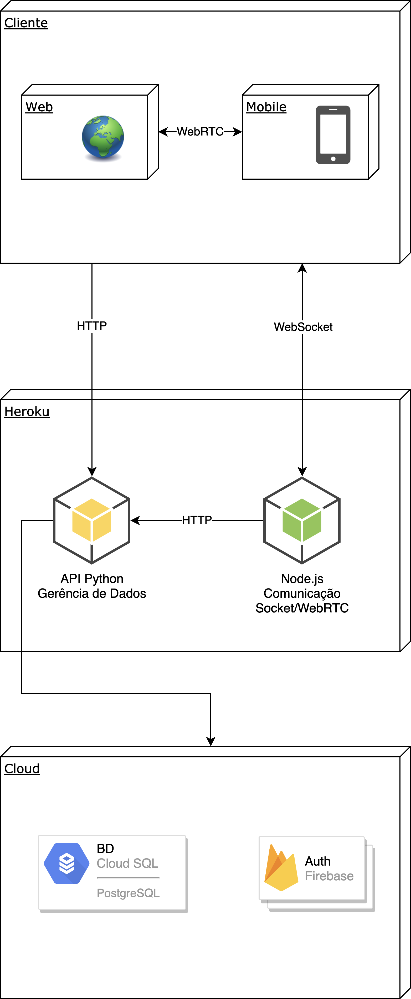

# Amigle

* Arthur Gramiscelli Branco, arthurgbranco@gmail.com
* Arthur Henrique Souza Braga, arthebraga@gmail.com
* Isabella Carine Cruz Nicácio, iccnicacio@gmail.com
* Lucas Alves Gusmão, lalvesgusmao@gmail.com
* Samuel Alves de Castro Baker, sacbaker@gmail.com

---

Professores:

* Hugo Bastos de Paula
* Pedro Alves de Oliveira

---

_Curso de Engenharia de Software, Unidade Praça da Liberdade_

_Instituto de Informática e Ciências Exatas – Pontifícia Universidade de Minas Gerais (PUC MINAS), Belo Horizonte – MG – Brasil_

---

_**Resumo**. O Amigle será uma plataforma online de bate papo guiada por interesses em comum. Nele é possível encontrar pessoas que tenham o mesmo gosto, seja para uma curta conversa ou para fazer novas amizades.

---

## Histórico de Revisões

| **Data** | **Autor** | **Descrição** | **Versão** |
| --- | --- | --- | --- |
| **[23/02/2021]** | [Lucas Alves Gusmão] | [Versão preliminar do documento (capitulo 1)] | 1 |
| **[07/03/2021]** | [Grupo] | [Correções e finalizações do capitulo 2] | 2 |

## SUMÁRIO

1. [Apresentação](#apresentacao "Apresentação")  
	1.1. Problema  
	1.2. Objetivos do trabalho  
	1.2.1. Objetivo geral  
	1.2.2. Objetivos específicos  
	1.3. Definições e Abreviaturas  

2. [Requisitos](#requisitos "Requisitos")  
'	2.1. Requisitos Funcionais  
	2.2. Requisitos Não-Funcionais  
	2.3. Restrições Arquiteturais  
	2.4. Mecanismos Arquiteturais  

3. [Modelagem](#modelagem "Modelagem e projeto arquitetural")  
	3.1. Visão de Negócio  
	3.2. Visão Lógica  
	3.3. Modelo de dados (opcional)  

4. [Avaliação](#avaliacao "Avaliação da Arquitetura")  
	4.1. Cenários  
	4.2. Avaliação  

5. [Referências](#referencias "REFERÊNCIAS") 

6. [Apêndices](#apendices "APÊNDICES") 

# 1. Apresentação

O Brasil possui cerca de 134 milhões de usuários da internet, e o seu principal uso pelo internauta brasileiro é a socialização[1]. No entanto, as redes sociais mais utilizadas como Whatsapp, Facebook e Instagram são mais adequadas para a socialização entre circulos sociais já pré-existentes na vida da pessoa, o que as torna não tão ideal para o conhecimento de pessoas novas.

Visando prover uma alternativa mais focada no O Amigle será uma plataforma online de bate papo guiada por interesses em comum. Nele é possível encontrar pessoas que tenham o mesmo gosto, seja para uma curta conversa ou para fazer novas amizades.

Ao criar um perfil, o usuário deve selecionar tags para associar a seu perfil. Cada tag representa um de seus interesses. Após adicionadas, é possível iniciar conversas com pessoas que possuem uma tag específica, ou procurar a pessoa mais compatível.

## 1.1. Problema

Um dos maiores usos da internet na era moderna é para a socialização. Empresas focadas nesse mercado como o Twitter e Facebook são hoje gigantes no mundo da tecnologia, o que antes era um lugar reservado para empresas de Software e Hardware.

No entanto, a maioria destas plataformas são mais adequadas para a socialização entre um circulo social pré-existente na vida da pessoa, como seus amigos, família, colegas, etc.

Em contraponto, existem plataformas como o Omegle e Chatroulette, que permitem que usuários conheçam outras pessoas de forma aleatória, porém, por possuir poucos ou nenhum filtro, se torna não muito eficiente para este propósito.

## 1.2. Objetivos do trabalho

### 1.2.1 Objetivo Geral
O Amigle é uma plataforma disponível para web, iOS e Android com o objetivo permitir que pessoas se conheçam com base em seus interesses em comum, que são representados por meio de tags.

### 1.2.2 Objetivos Específicos
O trabalho tem como o objetivo desenvolver 3 platafomas distintas, porém que funcionam em conjunto. São elas:

- Aplicação móvel de chat
- Aplicação web de chat
- Aplicação web de administração do sistema

Para realizar o desenvolvimento destas aplicações, serão realizadas diversas etapas de trabalho, como:

- Coletar requisitos
- Fazer o desenho de diagramas
- Fazer mockups e wireframes das telas
- Criar o projeto arquitetural a ser utilizado como base no desenvolvimento
- Desenvolver as soluções de software propostas

## 1.3. Definições e Abreviaturas

- Tag: representação do sistema de interesse/assunto de interesse do usuário
- Match: união que estabelece o chat entre dois usuários com base em seus interesses, realizada automaticamente pelo sistema

# 2. Requisitos

## 2.1. Requisitos Funcionais

| **ID** | **Descrição** | **Prioridade** |
| --- | --- | --- |
| RF01 | Cadastro de usuário | alta
| RF02 | Login de usuário | alta
| RF03 | Usuário adicionar ou remover tags de seus interesses | alto
| RF04 | Usuário entrar em chat com pessoa aleatória com base em interesses | alto
| RF05 | Usuário entrar em chat com pessoa com base em uma tag específica | médio
| RF06 | Usuário entrar em chamada de vídeo com pessoa | médio
| RF07 | Gerenciar tags | alta
| RF08 | Gerenciar categorias | alta
| RF09 | Remover usuários da plataforma (administrador) | baixa
| RF10 | Exclusão de conta de usuário (usuário) | alta

## 2.2. Requisitos Não-Funcionais

| **ID** | **Descrição** |
| --- | --- |
| RNF001 | O sistema deve providenciar comunicação em tempo real |
| RNF002 | A aplicação web deve ter uma interface responsiva |
| RNF003 | As aplicações devem ter um visual em conformidade com o Material Design |
| RNF004 | A autenticação deve utilizar o protocolo OAuth 2 |
| RNF005 | Os dados devem ser persistidos em um banco de dados relacional |
| RNF006 | O sistema deve possuir uma interface de administrador com as rotas protegidas |

## 2.3. Restrições Arquiteturais

Para o desenvolvimento das duas aplicações, web e móvel, serão utilizadas tecnologias de ponta de desenvolvimento de software, focadas em escalabilidade, experiência de usuário e performance.

No desenvolvimento móvel será utilizado o framework Flutter, por permitir o desenvolviemnto de aplicações multiplataforma com uma boa experiência de usuário. Já na web, será utilizado o framework Svelte, utilizado para o desenvolvimento de interfaces web rápidas e leves em comparação com suas alternativas, como o React e Vue.

Já no back-end, será utilizada uma arquitetura de microsserviços distribuídos. Haverão 2 microsserviços com objetivos distintos:

1. Permanência e manipulação de dados, fila de mensagens, match de usuários (Python, Flask)
2. Comunicação entre usuários (NodeJS, Typescript, Express, Socket.io)

O SGBD utilizado para a persistência de dados será o PostgreSQL.

## 2.4. Mecanismos Arquiteturais
<!-- _Visão geral dos mecanismos que compõem a arquitetura do sosftware baseando-se em três estados: (1) análise, (2) design e (3) implementação. Em termos de Análise devem ser listados os aspectos gerais que compõem a arquitetura do software como: persistência, integração com sistemas legados, geração de logs do sistema, ambiente de front end, tratamento de exceções, formato dos testes, formato de distribuição/implantação (deploy), entre outros. Em Design deve-se identificar o padrão tecnológico a seguir para cada mecanismo identificado na análise. Em Implementação, deve-se identificar o produto a ser utilizado na solução.
 Ex: Análise (Persistência), Design (ORM), Implementação (Hibernate)._ -->

| **Análise** | **Design** | **Implementação** |
| --- | --- | --- |
| Persistência | API Rest + SGBD | API Rest com o framework Flask que comunica com SGBD PostgreSQL |
| Front end | Single Page Application | Aplicação Svelte com roteamento no cliente |
| Back end 1 | Microsserviço de persistência de dados, fila de mensagens e match de usuários | Microsserviço desenvolvido com Python e Flask |
| Back end 2 | Microsserviço de comunicação entre usuários com protocolo WebRTC | Microsserviço  |
| Integração | Autenticação por meio do protocolo OAuth2 | Serviço de autenticação do Firebase |
| Teste de Software | Testes e2e | WebdriverIO |
| Deploy | Serviço de deployment de aplicações | Heroku e GCP |

# 3. Modelagem e projeto arquitetural

_Apresente uma visão geral da solução proposta para o projeto e explique brevemente esse diagrama de visão geral, de forma textual. Esse diagrama não precisa seguir os padrões da UML, e deve ser completo e tão simples quanto possível, apresentando a macroarquitetura da solução._

**Figura 1 - Visão Geral da Solução (fonte: https://medium.com)**

Obs: substitua esta imagem por outra, adequada ao seu projeto (cada arquitetura é única).

## 3.1. Visão de Negócio (Funcionalidades)

_Apresente uma lista simples com as funcionalidades previstas no projeto (escopo do produto)._

1. O sistema deve...
2. O sistema deve...
3. ...

Obs: a quantidade e o escopo das funcionalidades deve ser negociado com os professores/orientadores do trabalho.

### Descrição resumida dos Casos de Uso / Histórias de Usuário

_Nesta seção, os casos de uso devem ser resumidos. Esse detalhamento pode ser na forma de um texto sintético ou, alternativamente, você pode optar por descrever estórias de usuários seguindo os métodos ágeis. Neste caso a seção deve chamar &quot;Histórias de usuários&quot;. Lembre-se das características de qualidade das estórias de usuários, ou seja, o que é preciso para descrever boas histórias de usuários._

Exemplos de resumo de Casos de Uso:

#### UC01 – NOME DO CASO DE USO 01

| **Descrição** | |
| --- | --- |
| **Atores** | |
| **Prioridade** | |
| **Requisitos associados** | |
| **Fluxo Principal** | |

#### UC02 – NOME DO CASO DE USO 02

| **Descrição** | |
| --- | --- |
| **Atores** | |
| **Prioridade** | |
| **Requisitos associados** | |
| **Fluxo Principal** | |

Exemplos de Histórias de Usuário:

- Como Fulano eu quero poder convidar meus amigos para que a gente possa se reunir...

- Como Cicrano eu quero poder organizar minhas tarefas diárias, para que...

- Como gerente eu quero conseguir entender o progresso do trabalho do meu time, para que eu possa ter relatórios periódicos dos nossos acertos e falhas.

## 3.2. Visão Lógica

_Apresente os artefatos que serão utilizados descrevendo em linhas gerais as motivações que levaram a equipe a utilizar estes diagramas._

### Diagrama de Classes

**Figura 2 – Diagrama de classes (exemplo). Fonte: o próprio autor.**

Obs: Acrescente uma breve descrição sobre o diagrama apresentado na Figura 3.

### Diagrama de componentes

_Apresente o diagrama de componentes da aplicação, indicando, os elementos da arquitetura e as interfaces entre eles. Liste os estilos/padrões arquiteturais utilizados e faça uma descrição sucinta dos componentes indicando o papel de cada um deles dentro da arquitetura/estilo/padrão arquitetural. Indique também quais componentes serão reutilizados (navegadores, SGBDs, middlewares, etc), quais componentes serão adquiridos por serem proprietários e quais componentes precisam ser desenvolvidos._

**Figura 3 – Diagrama de Componentes (exemplo). Fonte: o próprio autor.**

_Apresente uma descrição detalhada dos artefatos que constituem o diagrama de implantação._

Ex: conforme diagrama apresentado na Figura X, as entidades participantes da solução são:

- **Componente 1** - Lorem ipsum dolor sit amet, consectetur adipiscing elit. Cras nunc magna, accumsan eget porta a, tincidunt sed mauris. Suspendisse orci nulla, sagittis a lorem laoreet, tincidunt imperdiet ipsum. Morbi malesuada pretium suscipit.
- **Componente 2** - Praesent nec nisi hendrerit, ullamcorper tortor non, rutrum sem. In non lectus tortor. Nulla vel tincidunt eros.

## 3.3. Modelo de dados (opcional)

_Caso julgue necessário para explicar a arquitetura, apresente o diagrama de classes ou diagrama de Entidade/Relacionamentos ou tabelas do banco de dados. Este modelo pode ser essencial caso a arquitetura utilize uma solução de banco de dados distribuídos ou um banco NoSQL._

 ")

**Figura 4 – Diagrama de Entidade Relacionamento (ER) - exemplo. Fonte: o próprio autor.**

Obs: Acrescente uma breve descrição sobre o diagrama apresentado na Figura 3.

# 4. Avaliação da Arquitetura

_Esta seção descreve a avaliação da arquitetura apresentada, baseada no método ATAM._

## 4.1. Cenários

_Apresente os cenários de testes utilizados na realização dos testes da sua aplicação. Escolha cenários de testes que demonstrem os requisitos não funcionais sendo satisfeitos. Os requisitos a seguir são apenas exemplos de possíveis requisitos, devendo ser revistos, adequados a cada projeto e complementados de forma a terem uma especificação completa e auto-explicativa._

**Cenário 1 - Acessibilidade:** Suspendisse consequat consectetur velit. Sed sem risus, dictum dictum facilisis vitae, commodo quis leo. Vivamus nulla sem, cursus a mollis quis, interdum at nulla. Nullam dictum congue mauris. Praesent nec nisi hendrerit, ullamcorper tortor non, rutrum sem. In non lectus tortor. Nulla vel tincidunt eros.

**Cenário 2 - Interoperabilidade:** Pellentesque habitant morbi tristique senectus et netus et malesuada fames ac turpis egestas. Fusce ut accumsan erat. Pellentesque in enim tempus, iaculis sem in, semper arcu.

**Cenário 3 - Manutenibilidade:** Phasellus magna tellus, consectetur quis scelerisque eget, ultricies eu ligula. Sed rhoncus fermentum nisi, a ullamcorper leo fringilla id. Nulla lacinia sem vel magna ornare, non tincidunt ipsum rhoncus. Nam euismod semper ante id tristique. Mauris vel elit augue.

**Cenário 4 - Segurança:** Suspendisse consectetur porta tortor non convallis. Sed lobortis erat sed dignissim dignissim. Nunc eleifend elit et aliquet imperdiet. Ut eu quam at lacus tincidunt fringilla eget maximus metus. Praesent finibus, sapien eget molestie porta, neque turpis congue risus, vel porttitor sapien tortor ac nulla. Aliquam erat volutpat.

## 4.2. Avaliação

_Apresente as medidas registradas na coleta de dados. O que não for possível quantificar apresente uma justificativa baseada em evidências qualitativas que suportam o atendimento do requisito não-funcional. Apresente uma avaliação geral da arquitetura indicando os pontos fortes e as limitações da arquitetura proposta._

| **Atributo de Qualidade:** | Segurança |
| --- | --- |
| **Requisito de Qualidade** | Acesso aos recursos restritos deve ser controlado |
| **Preocupação:** | Os acessos de usuários devem ser controlados de forma que cada um tenha acesso apenas aos recursos condizentes as suas credenciais. |
| **Cenários(s):** | Cenário 4 |
| **Ambiente:** | Sistema em operação normal |
| **Estímulo:** | Acesso do administrador do sistema as funcionalidades de cadastro de novos produtos e exclusão de produtos. |
| **Mecanismo:** | O servidor de aplicação (Rails) gera um _token_ de acesso para o usuário que se autentica no sistema. Este _token_ é transferido para a camada de visualização (Angular) após a autenticação e o tratamento visual das funcionalidades podem ser tratados neste nível. |
| **Medida de Resposta:** | As áreas restritas do sistema devem ser disponibilizadas apenas quando há o acesso de usuários credenciados. |

**Considerações sobre a arquitetura:**

| **Riscos:** | Não existe |
| --- | --- |
| **Pontos de Sensibilidade:** | Não existe |
| _ **Tradeoff** _ **:** | Não existe |

Evidências dos testes realizados

_Apresente imagens, descreva os testes de tal forma que se comprove a realização da avaliação._

# 5. REFERÊNCIAS

**[1]** - VALENTE, Jonas. **Brasil tem 134 milhões de usuários de internet, aponta pesquisa**. https://agenciabrasil.ebc.com.br/geral/noticia/2020-05/brasil-tem-134-milhoes-de-usuarios-de-internet-aponta-pesquisa. Acesso em: 3 de mar. de 2021.

<!-- _Como um projeto da arquitetura de uma aplicação não requer revisão bibliográfica, a inclusão das referências não é obrigatória. No entanto, caso você deseje incluir referências relacionadas às tecnologias, padrões, ou metodologias que serão usadas no seu trabalho, relacione-as de acordo com a ABNT._ -->

<!-- Verifique no link abaixo como devem ser as referências no padrão ABNT: -->

<!-- http://www.pucminas.br/imagedb/documento/DOC\_DSC\_NOME\_ARQUI20160217102425.pdf -->

<!-- **[1]** - _ELMASRI, Ramez; NAVATHE, Sham. **Sistemas de banco de dados**. 7. ed. São Paulo: Pearson, c2019. E-book. ISBN 9788543025001._

**[2]** - _COPPIN, Ben. **Inteligência artificial**. Rio de Janeiro, RJ: LTC, c2010. E-book. ISBN 978-85-216-2936-8._

**[3]** - _CORMEN, Thomas H. et al. **Algoritmos: teoria e prática**. Rio de Janeiro, RJ: Elsevier, Campus, c2012. xvi, 926 p. ISBN 9788535236996._

**[4]** - _SUTHERLAND, Jeffrey Victor. **Scrum: a arte de fazer o dobro do trabalho na metade do tempo**. 2. ed. rev. São Paulo, SP: Leya, 2016. 236, [4] p. ISBN 9788544104514._

**[5]** - _RUSSELL, Stuart J.; NORVIG, Peter. **Inteligência artificial**. Rio de Janeiro: Elsevier, c2013. xxi, 988 p. ISBN 9788535237016._ -->

# 6. APÊNDICES

_Inclua o URL do repositório (Github, Bitbucket, etc) onde você armazenou o código da sua prova de conceito/protótipo arquitetural da aplicação como anexos. A inclusão da URL desse repositório de código servirá como base para garantir a autenticidade dos trabalhos._
