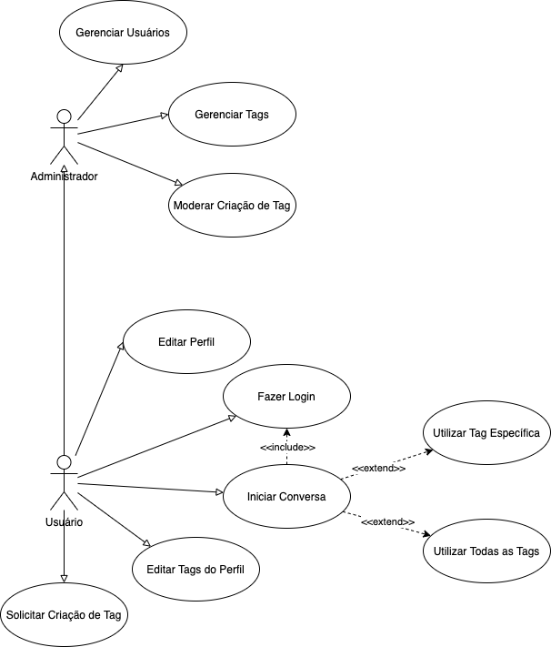

# Amigle

* Arthur Gramiscelli Branco, arthurgbranco@gmail.com
* Arthur Henrique Souza Braga, arthesbraga@gmail.com
* Isabella Carine Cruz Nicácio, iccnicacio@gmail.com
* Lucas Alves Gusmão, lalvesgusmao@gmail.com
* Samuel Alves de Castro Baker, sacbaker@sga.pucminas.br

---

Professores:

* Hugo Bastos de Paula
* Pedro Alves de Oliveira

---

_Curso de Engenharia de Software, Unidade Praça da Liberdade_

_Instituto de Informática e Ciências Exatas – Pontifícia Universidade de Minas Gerais (PUC MINAS), Belo Horizonte – MG – Brasil_

---

**Resumo**. O Amigle será uma plataforma online de bate papo guiada por interesses em comum. Nele é possível encontrar pessoas que tenham o mesmo gosto, seja para uma curta conversa ou para fazer novas amizades.

---

## Histórico de Revisões

| **Data** | **Autor** | **Descrição** | **Versão** |
| --- | --- | --- | --- |
| **[23/02/2021]** | [Lucas Alves Gusmão] | [Versão preliminar do documento (capitulo 1)] | 1 |
| **[07/03/2021]** | [Grupo] | [Correções e finalizações do capitulo 2] | 2 |
| **[06/04/2021]** | [Arthur Branco] | [Visões arquiteturais, diagramas e finalização do capitulo 3] | 3 |

## SUMÁRIO

1. [Apresentação](#apresentacao "Apresentação")  
	1.1. Problema  
	1.2. Objetivos do trabalho  
	1.2.1. Objetivo geral  
	1.2.2. Objetivos específicos  
	1.3. Definições e Abreviaturas  

2. [Requisitos](#requisitos "Requisitos")  
'	2.1. Requisitos Funcionais  
	2.2. Requisitos Não-Funcionais  
	2.3. Restrições Arquiteturais  
	2.4. Mecanismos Arquiteturais  

3. [Modelagem](#modelagem "Modelagem e projeto arquitetural")  
	3.1. Visão de Negócio  
	3.2. Visão Lógica  
	3.3. Modelo de dados  

4. [Avaliação](#avaliacao "Avaliação da Arquitetura")  
	4.1. Cenários  
	4.2. Avaliação  

5. [Referências](#referencias "REFERÊNCIAS") 

6. [Apêndices](#apendices "APÊNDICES") 

# 1. Apresentação

O Brasil possui cerca de 134 milhões de usuários da internet, e o seu principal uso pelo internauta brasileiro é a socialização[1]. No entanto, as redes sociais mais utilizadas como Whatsapp, Facebook e Instagram são mais adequadas para a socialização entre circulos sociais já pré-existentes na vida da pessoa, o que as torna não tão ideal para o conhecimento de pessoas novas.

Visando prover uma alternativa mais focada no O Amigle será uma plataforma online de bate papo guiada por interesses em comum. Nele é possível encontrar pessoas que tenham o mesmo gosto, seja para uma curta conversa ou para fazer novas amizades.

Ao criar um perfil, o usuário deve selecionar tags para associar a seu perfil. Cada tag representa um de seus interesses. Após adicionadas, é possível iniciar conversas com pessoas que possuem uma tag específica, ou procurar a pessoa mais compatível.

## 1.1. Problema

Um dos maiores usos da internet na era moderna é para a socialização. Empresas focadas nesse mercado como o Twitter e Facebook são hoje gigantes no mundo da tecnologia, o que antes era um lugar reservado para empresas de Software e Hardware.

No entanto, a maioria destas plataformas são mais adequadas para a socialização entre um circulo social pré-existente na vida da pessoa, como seus amigos, família, colegas, etc.

Em contraponto, existem plataformas como o Omegle e Chatroulette, que permitem que usuários conheçam outras pessoas de forma aleatória, porém, por possuir poucos ou nenhum filtro, se torna não muito eficiente para este propósito.

## 1.2. Objetivos do trabalho

### 1.2.1 Objetivo Geral
O Amigle é uma plataforma disponível para web, iOS e Android com o objetivo permitir que pessoas se conheçam com base em seus interesses em comum, que são representados por meio de tags.

### 1.2.2 Objetivos Específicos
O trabalho tem como o objetivo desenvolver 3 platafomas distintas, porém que funcionam em conjunto. São elas:

- Aplicação móvel de chat
- Aplicação web de chat
- Aplicação web de administração do sistema

Para realizar o desenvolvimento destas aplicações, serão realizadas diversas etapas de trabalho, como:

- Coletar requisitos
- Fazer o desenho de diagramas
- Fazer mockups e wireframes das telas
- Criar o projeto arquitetural a ser utilizado como base no desenvolvimento
- Desenvolver as soluções de software propostas

## 1.3. Definições e Abreviaturas

- Tag: representação do sistema de interesse/assunto de interesse do usuário
- Match: união que estabelece o chat entre dois usuários com base em seus interesses, realizada automaticamente pelo sistema

# 2. Requisitos

## 2.1. Requisitos Funcionais

| **ID** | **Descrição** | **Prioridade** |
| --- | --- | --- |
| RF01 | Cadastro de usuário | alta
| RF02 | Login de usuário | alta
| RF03 | Usuário adicionar ou remover tags de seus interesses | alto
| RF04 | Usuário entrar em chat com pessoa aleatória com base em interesses | alto
| RF05 | Gerenciar tags | alta
| RF06 | Gerenciar categorias | alta
| RF07 | Usuário entrar em chat com pessoa com base em uma tag específica | médio
| RF08 | Usuário entrar em chamada de vídeo com pessoa | médio
| RF09 | Remover usuários da plataforma (administrador) | baixa
| RF10 | Usuário sugerir tag para administrador | baixa
| RF11 | Administrador visualizar estatísticas sobre o uso da aplicação | baixa
| RF12 | Usuário visualizar histórico de conversas | baixa
| RF13 | Usuário visualizar tags em alta | baixa

## 2.2. Requisitos Não-Funcionais

| **ID** | **Descrição** |
| --- | --- |
| RNF001 | O sistema deve providenciar comunicação em tempo real |
| RNF002 | A aplicação web deve ter uma interface responsiva |
| RNF003 | As aplicações devem ter um visual em conformidade com o Material Design |
| RNF004 | A autenticação deve utilizar o protocolo OAuth 2 |
| RNF005 | Os dados devem ser persistidos em um banco de dados relacional |
| RNF006 | O sistema deve possuir uma interface de administrador com as rotas protegidas |

## 2.3. Restrições Arquiteturais

Para o desenvolvimento das duas aplicações, web e móvel, serão utilizadas tecnologias de ponta de desenvolvimento de software, focadas em escalabilidade, experiência de usuário e performance.

No desenvolvimento móvel será utilizado o framework Flutter, por permitir o desenvolviemnto de aplicações multiplataforma com uma boa experiência de usuário. Já na web, será utilizado o framework Svelte, utilizado para o desenvolvimento de interfaces web rápidas e leves em comparação com suas alternativas, como o React e Vue.

Já no back-end, será utilizada uma arquitetura de microsserviços distribuídos. Haverão 2 microsserviços com objetivos distintos:

1. Permanência e manipulação de dadoss (Python, Flask)
2. Comunicação entre usuários (NodeJS, Typescript, Express, Socket.io)

O SGBD utilizado para a persistência de dados será o PostgreSQL.

## 2.4. Mecanismos Arquiteturais

| **Análise** | **Design** | **Implementação** |
| --- | --- | --- |
| Persistência | API Rest + SGBD | API Rest com o framework Flask que comunica com SGBD PostgreSQL |
| Front end | Single Page Application | Aplicação Svelte com roteamento no cliente |
| Back end 1 | Microsserviço de persistência de dados | Microsserviço desenvolvido com Python e Flask |
| Back end 2 | Microsserviço de comunicação entre usuários com protocolo WebRTC | Microsserviço  |
| Integração | Autenticação por meio do protocolo OAuth2 | Serviço de autenticação do Firebase |
| Teste de Software | Testes e2e | WebdriverIO |
| Deploy | Serviço de deployment de aplicações | Heroku e GCP |

# 3. Modelagem e projeto arquitetural

A visão prevê uma aplicação distribuida que utiliza microservições e uma aplicação mobile a serem implementadas em soluções cloud. Se compoe por duas camadas front-end paralelas (web e mobile) com backend base somado a multiplos microservições que utilizam como camada de persistência um banco de dados na nuvem e um serviço de mensageria.

**Figura 1 - Visão Geral da Solução**

## 3.1. Visão de Negócio (Funcionalidades)

<!-- _Apresente uma lista simples com as funcionalidades previstas no projeto (escopo do produto)._ -->

<!-- 1. O sistema deve...
2. O sistema deve...
3. ...

Obs: a quantidade e o escopo das funcionalidades deve ser negociado com os professores/orientadores do trabalho. -->

### Diagrama de Casos de Uso

### Descrição resumida dos Casos de Uso / Histórias de Usuário

<!-- _Nesta seção, os casos de uso devem ser resumidos. Esse detalhamento pode ser na forma de um texto sintético ou, alternativamente, você pode optar por descrever estórias de usuários seguindo os métodos ágeis. Neste caso a seção deve chamar &quot;Histórias de usuários&quot;. Lembre-se das características de qualidade das estórias de usuários, ou seja, o que é preciso para descrever boas histórias de usuários._ -->

Resumos de casos de uso:

#### UC01 – Gerência de usuários

| **Descrição** | Gerenciar Usuários |
| --- | --- |
| **Atores** | Usuário administrador |
| **Prioridade** | 	Baixa |
| **Requisitos associados** | RF09  |
| **Fluxo Principal** | 1) O administrador loga na plataforma  2) O administrador clica para gerenciar usuários  3) O administrador escolher se aceita ou nega um usuário  4) O administrador confirma a ação |
#### UC02 – Gerência de tags

| **Descrição** | Gerenciar Tags |
| --- | --- |
| **Atores** | Usuário administrador |
| **Prioridade** | 	Alta |
| **Requisitos associados** | RF05,  RF06 |
| **Fluxo Principal** | 1) O administrador loga na plataforma  2) O administrador clica para gerenciar tags  3) O administrador escolher se apaga ou edita determinada tag  4) O administrador confirma a ação |

#### UC03 – Moderação de tags

| **Descrição** | Moderar criação de Tags |
| --- | --- |
| **Atores** | Usuário administrador |
| **Prioridade** | 	Alta |
| **Requisitos associados** |  RF05, RF06 |
| **Fluxo Principal** | 1) O administrador loga na plataforma  2) O administrador clica para gerenciar tags  3) O administrador escolher se aceita ou nega determinada tag  4) O administrador confirma a ação |

#### UC04 – Edição de perfil

| **Descrição** | Editar Perfil |
| --- | --- |
| **Atores** | Usuário |
| **Prioridade** | 	Alta |
| **Requisitos associados** | RF01 |
| **Fluxo Principal** | 1) O usuário loga na plataforma  2) O usuário clica para editar perfil  3) O usuário edita suas informações de acordo com sua necessidade  4) O usuário confirma a ação |

#### UC05 – Login no sistema

| **Descrição** | Fazer login |
| --- | --- |
| **Atores** | Usuário e usuário administrador |
| **Prioridade** | 	Alta |
| **Requisitos associados** | RF02 |
| **Fluxo Principal** | 1) O usuário entra na plataforma  2) O usuário clica para digitar seu login  3) O usuário clica para digitar sua senha  4) O usuário confirma a ação |
| **Fluxo Alternativo** | 1) O usuário entra na plataforma  2) O usuário clica para digitar um login incorreto ou senha incorreta  3) O usuário confirma a ação  4) O usuário não loga no sistema |
| **Fluxo Alternativo** | 1) O usuário entra na plataforma  2) O usuário clica para recuperar senha  3) O usuário confirma a ação  4) O usuário recebe email para alterar senha  5) O usuário clica para recuperar senha  6) Usuário digita nova senha
   
#### UC06 – Conversa

| **Descrição** | Iniciar Conversa |
| --- | --- |
| **Atores** | Usuário |
| **Prioridade** | 	Média |
|**Dependência**| UC05 |
| **Requisitos associados** | RF07, RF04 |
| **Fluxo Principal** | 1) O usuário loga na plataforma  2) O usuário clica para iniciar conversa por tag específica  3) O usuário entra em uma fila de espera 4) O usuário inicia a conversa |
**Fluxo Alternativo** | 1) O usuário loga na plataforma  2) O usuário clica para iniciar conversa por todas as tags  3) O usuário entra em uma fila de espera  4) O usuário inicia a conversa |

#### UC07 – Edição de tags do usuário

| **Descrição** | Editar tags do perfil |
| --- | --- |
| **Atores** | Usuário |
| **Prioridade** | 	Alta |
| **Requisitos associados** | RF03 |
| **Fluxo Principal** | 1) O usuário loga na plataforma  2) O usuário clica para editar tags  3) O usuário edita as informações de acordo com sua necessidade  4) O usuário confirma a ação |

#### UC08 – Solicitação de novas tags

| **Descrição** | Solicitar criação de tags |
| --- | --- |
| **Atores** | Usuário |
| **Prioridade** | 	Baixa |
| **Requisitos associados** | RF10 |
| **Fluxo Principal** | 1) O usuário loga na plataforma  2) O usuário clica para solicitar novas tags  4) O usuário confirma a ação |

#### UC09 – Tags em alta

| **Descrição** | Visualização de tags em alta |
| --- | --- |
| **Atores** | Usuário |
| **Prioridade** | 	Baixa |
| **Requisitos associados** | RF11 |
| **Fluxo Principal** | 1) O usuário loga na plataforma  2) O usuário clica para ver as tags em alta |

#### UC010 – Tags em alta

| **Descrição** | Visualização de históricos de conversa |
| --- | --- |
| **Atores** | Usuário |
| **Prioridade** | 	Baixa |
| **Requisitos associados** | RF12 |
| **Fluxo Principal** | 1) O usuário loga na plataforma  2) O usuário clica para ver o histórico de conversas |

#### UC011 – Tags em alta

| **Descrição** | Visualização de estátisticas de conversa |
| --- | --- |
| **Atores** | Administrador |
| **Prioridade** | 	Baixa |
| **Requisitos associados** | RF13 |
| **Fluxo Principal** | 1) O administrador loga na plataforma  2) O administrador clica para ver o histórico de conversas  3) O administrador seleciona os filtros de estátisticas  4) O administrador confirma ação |

Exemplos de Histórias de Usuário:

- Como administrador eu quero poder gerenciar os usuários da minha plataforma, para que eu possa ter o controle de quem usa meu software

- Como administrador eu quero poder gerenciar as tags da minha plataforma, para que eu possa ter controle sobre as tags meus usuários desejam criar

- Como administrador eu quero poder gerenciar a criação de tags indicadas pelos usuários, para que eu possa ter o controle de o que meus usuários estão conversando

- Como usuário eu gostaria de poder editar meu perfil para que eu informe meus dados corretamente, caso eu tenha cometido algum erro

- Como usuário eu gostaria de poder realizar meu login no software, para que eu possa utilizar de seus serviços

- Como usuário eu gostaria de poder iniciar uma conversa de acordo com uma tag específica anteriormente indicada por mim, para que eu possa encontrar novos amigos com um gosto similar ao meu

- Como usuário eu gostaria de poder iniciar uma conversa de acordo com todas as tags de meu perfil anteriormente indicadas por mim, para que eu possa encontrar novos amigos com gostos similares aos meus

- Como usuário eu gostaria de poder editar as tags de meu perfil, para que eu informe meus gostos corretamente

- Como usuário eu gostaria de poder solicitar novas tags para a plataforma, para que eu as adicione ao meu pefil

- Como usuário eu gostaria de poder visualizar as tags mais faladas (em alta), para que eu possa ficar interado dos assuntos mais conversados

- Como usuário eu gostaria de poder visualizar os históricos de pessoas que eu conversei, para que eu possa entrar em contato com elas no futuro caso seja de minha vontade

- Como administrador eu gostaria de poder visualizar as estatísticas de conversas, para que eu possa ficar interado e ter novos insights dos assuntos que meus usuários estão interagindo

## 3.2. Visão Lógica

* O diagrama de classe foi escolhido como artefato relevante para o projeto para que a equipe tivesse uma visão prévia geral da arquitetura do código e fossem discutidas a partir dele os planos de comunicação dos componentes do projeto. 
* O diagrama de componentes foi feito para mapear as comunicações e para facilitar o planejamento dos protocolos e elementos externos a serem utilizados.
* O diagrama de Entidade Relacionamento (ER) foi escolhido para padronizar parte da estrutura de dados utilizada no projeto e estabelecer relacionamento entre as entidades participantes, garantindo maior durabilidade das informações do sistema e resistencia a falhas.

## 3.2.1. Diagrama de Classes

**Figura 2 – Diagrama de classes Fonte: o próprio autor.**

Nesse diagrama podemos observar que tags serão associadas aos usuários que irão participar dos chats no sistema e que será criado um CRUD para cada entidade.

## 3.2.2. Diagrama de componentes

**Figura 3 – Diagrama de Componentes. Fonte: o próprio autor.**

Conforme diagrama apresentado na Figura 3, os componentes desenvolvidos pela solução do projeto são:

- **Componente 1 (Aplicação Web)** - Responsável por uma das camadas de apresentação, a aplicação web apresenta rotas para as logicas de perfil, cadastro, login e chat, também contendo uma pagina de administração para gerência das tags disponiveis.
- **Componente 2 (Aplicação Móvel)** - Responsável pela camada de apresentação alternativa, apresenta as mesmas funcionalidades da aplicação web, fora a plataforma de administração.
- **Componente 3 (Gerencia de dados)** - Responsável pela parte lógica da aplicação, ela controla a validade de autenticação, controle de dados e comunicação com banco de dados, controle das tags disponiveis e informações de usuarios.
- **Componente 4 (Comunicação WebRTC)** - Esta camada é responsável pela lógica e protocolos de conexão de chat entre os usuários.

## 3.3.3. Modelo de Entidade Relacionamento

 ")

**Figura 4 – Diagrama de Entidade Relacionamento (ER). Fonte: o próprio autor.**

**Figura 5 – Modelo Lógico. Fonte: o próprio autor.**

Esse diagrama apresenta as entidades e seus relacionamentos utilizados na aplicação e armazenados no banco de dados.

# 4. Avaliação da Arquitetura

Esta seção descreve a avaliação da arquitetura apresentada, baseada no método ATAM.

## 4.1. Cenários

<!-- _Apresente os cenários de testes utilizados na realização dos testes da sua aplicação. Escolha cenários de testes que demonstrem os requisitos não funcionais sendo satisfeitos. Os requisitos a seguir são apenas exemplos de possíveis requisitos, devendo ser revistos, adequados a cada projeto e complementados de forma a terem uma especificação completa e auto-explicativa._ -->

**Cenário 1 - Desempenho:** Para o desenvolvimento da aplicação front-end foi escolhida a biblioteca Svelte, que possui uma performance superior a outras populares como React, Angular e Vue por não possuir um virtual DOM e possuir uma etapa de compilação que otimiza o código. Já no aplicativo móvel foi escolhido o framework Flutter, que performa melhor que outras alternativas híbridas como React Native, Ionic, etc.

**Cenário 2 - Interoperabilidade:** Para a comunicação em tempo real foram escolhidos os protocolos WebSocket e WebRTC. Ambos os protocolos são nativos da web e possuem suporte no Flutter por meio de bibliotecas de terceiros trazendo ampla compatibilidade.

**Cenário 3 - Manutenibilidade:** Foi escolhida uma arquitetura de microsserviços que separa as funcionalidades de comunicação em tempo real e gerência de dados. Isso garante ao sistema mais granularidade e separação de responbilidade.

**Cenário 4 - Segurança:** Para a autenticação foi utilizado o serviço de auth do firebase, que garante segurança por meio do protocolo OAuth2.

## 4.2. Avaliação

| **Atributo de Qualidade:** | Desempenho |
| --- | --- |
| **Requisito de Qualidade** | O sistema deve ser performático em dispositivos |
| **Preocupação:** | O usuário deve poder acessar o sistema sem perdas de performance |
| **Cenários(s):** | Cenário 1 |
| **Ambiente:** | Navegador/celular em funcionamento padrão |
| **Estímulo:** | Acesso do usuário no sistema e realização de chamada de vídeo. Edição de perfil e de tags associadas. |
| **Mecanismo:** | Realização de testes no Google Lighthouse e no profiler do Flutter DevTools. |
| **Medida de Resposta:** | Os resultados devem estar dentro do intervalo considerado como bom de cada ferramenta de profiling. |

| **Atributo de Qualidade:** | Interoperabilidade |
| --- | --- |
| **Requisito de Qualidade** | Comunicação em tempo real entre as aplicações |
| **Preocupação:** | Deve ser possível realizar comunicação em tempo real entre as aplicações móveis e web |
| **Cenários(s):** | Cenário 2 |
| **Ambiente:** | Navegador/celular em funcionamento padrão |
| **Estímulo:** | Comunicação entre as aplicações |
| **Mecanismo:** | O servidor faz uma ponte entre os dois clientes, que se conectam de forma peer to peer para transmitir os dados WebRTC em tempo real. |
| **Medida de Resposta:** | Os dois peers devem se conectar e realizar a transmissão em tempo real |

| **Atributo de Qualidade:** | Manutenabilidade |
| --- | --- |
| **Requisito de Qualidade** | Separação de responsabilidades |
| **Preocupação:** | As diferentes partes do sistema devem ser separadas em relação à sua responsabilidade. |
| **Cenários(s):** | Cenário 3 |
| **Ambiente:** | Editor de código/ambiente de produção |
| **Estímulo:** | Permitir que o código seja facilmente melhorado/corrigido |
| **Mecanismo:** | O sistema é organizado entre 2 microsserviços de responsabilidades distintas: comunicação em tempo real e gerência de dados. |
| **Medida de Resposta:** | - |

| **Atributo de Qualidade:** | Segurança |
| --- | --- |
| **Requisito de Qualidade** | Acesso aos recursos restritos deve ser controlado |
| **Preocupação:** | Os acessos de usuários devem ser controlados de forma que cada um tenha acesso apenas aos recursos condizentes as suas credenciais. |
| **Cenários(s):** | Cenário 4 |
| **Ambiente:** | Navegador/celular em funcionamento padrão |
| **Estímulo:** | O administrador do sistema deve ter acesso às rotas protegidas |
| **Mecanismo:** | O sistema possui autenticação por meio do protocolo OAuth2 e um atributo que indica se o usuário é um administrador. |
| **Medida de Resposta:** | O administrador deve ser capaz de acessar as telas de administrador e os usuários comuns não. |

**Considerações sobre a arquitetura:**

| **Riscos:** | Não existe |
| --- | --- |
| **Pontos de Sensibilidade:** | Não existe |

Evidências dos testes realizados

_Apresente imagens, descreva os testes de tal forma que se comprove a realização da avaliação._

# 5. REFERÊNCIAS

**[1]** - VALENTE, Jonas. **Brasil tem 134 milhões de usuários de internet, aponta pesquisa**. https://agenciabrasil.ebc.com.br/geral/noticia/2020-05/brasil-tem-134-milhoes-de-usuarios-de-internet-aponta-pesquisa. Acesso em: 3 de mar. de 2021.

<!-- _Como um projeto da arquitetura de uma aplicação não requer revisão bibliográfica, a inclusão das referências não é obrigatória. No entanto, caso você deseje incluir referências relacionadas às tecnologias, padrões, ou metodologias que serão usadas no seu trabalho, relacione-as de acordo com a ABNT._ -->

<!-- Verifique no link abaixo como devem ser as referências no padrão ABNT: -->

<!-- http://www.pucminas.br/imagedb/documento/DOC\_DSC\_NOME\_ARQUI20160217102425.pdf -->

<!-- **[1]** - _ELMASRI, Ramez; NAVATHE, Sham. **Sistemas de banco de dados**. 7. ed. São Paulo: Pearson, c2019. E-book. ISBN 9788543025001._

**[2]** - _COPPIN, Ben. **Inteligência artificial**. Rio de Janeiro, RJ: LTC, c2010. E-book. ISBN 978-85-216-2936-8._

**[3]** - _CORMEN, Thomas H. et al. **Algoritmos: teoria e prática**. Rio de Janeiro, RJ: Elsevier, Campus, c2012. xvi, 926 p. ISBN 9788535236996._

**[4]** - _SUTHERLAND, Jeffrey Victor. **Scrum: a arte de fazer o dobro do trabalho na metade do tempo**. 2. ed. rev. São Paulo, SP: Leya, 2016. 236, [4] p. ISBN 9788544104514._

**[5]** - _RUSSELL, Stuart J.; NORVIG, Peter. **Inteligência artificial**. Rio de Janeiro: Elsevier, c2013. xxi, 988 p. ISBN 9788535237016._ -->

# 6. APÊNDICES

_Inclua o URL do repositório (Github, Bitbucket, etc) onde você armazenou o código da sua prova de conceito/protótipo arquitetural da aplicação como anexos. A inclusão da URL desse repositório de código servirá como base para garantir a autenticidade dos trabalhos._
